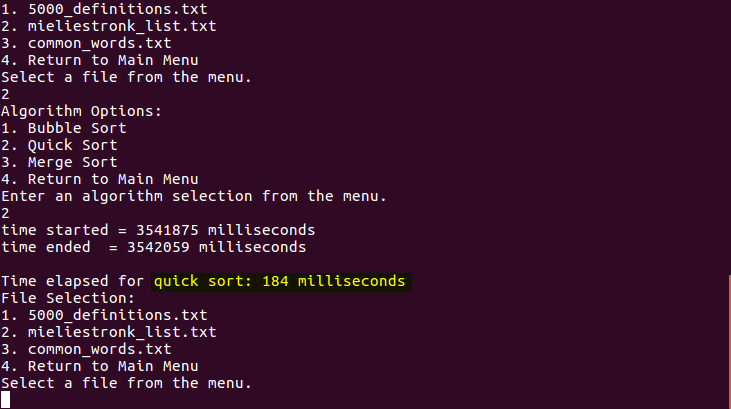
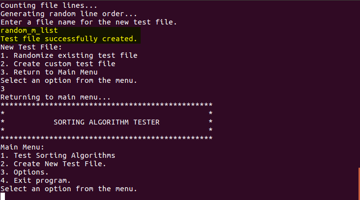
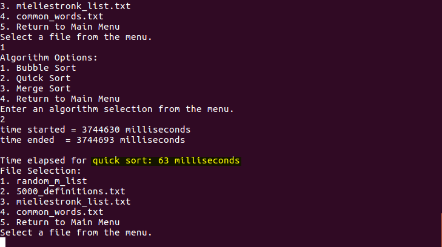
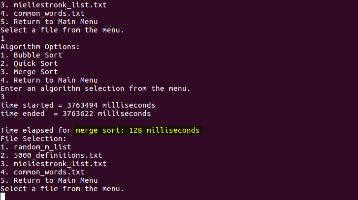

# sorting-algorithm-tester

## Program Description

This C program allows the user to run a selected sorting algorithm to order the contents of a selected file and show the time elapsed for the operation. The algorithms to choose from are bubble sort, quick sort, and merge sort. The contents for the provided test files were found freely available online and modified to be nearly sorted. The program also allows for the creation of new test files by collecting user input or randomizing existing test files. The series of screenshots below show the difference in performance when sorting operations are performed on nearly sorted file contents and randomly ordered file contents.

The following picture shows the results of quick sort on a nearly sorted file of +58000 lines.

<figure>
  
  <figcaption>Figure1. Quick Sort Nearly Sorted</figcaption>
</figure> 
 

The same file sorted by merge sort results in a shorter run time.

<figure>
  
  <figcaption>Figure 2. Merge Sort Nearly Sorted</figcaption>
</figure> 
 

The nearly sorted file is randomized to create a new test file.

<figure>
  
  <figcaption>Figure 3. Test File Creation</figcaption>
</figure> 
 

On the randomly ordered file, quick sort performs much faster.

<figure>
  
  <figcaption>Figure 4. Quick Sort Random</figcaption>
</figure> 
 

Merge sort performs more slowly than quick sort on the fully randomized contents.

<figure>
  
  <figcaption>Figure 5. Merge Sort Random</figcaption>
</figure> 
 
